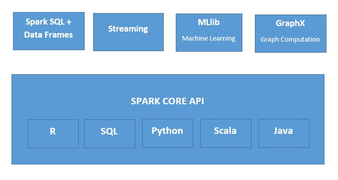

# Apache_Pyspark

Apache Spark is an open-source cluster-computing framework, built around speed, ease of use, and streaming analytics whereas Python is a general-purpose, high-level programming language. It provides a wide range of libraries and is majorly used for Machine Learning and Real-Time Streaming Analytics.

**Why use Python rather then Scala Or Java**

* Python is very easy to learn and implement.
* It provides simple and comprehensive API.
* With Python, the readability of code, maintenance, and familiarity is far better.
* It provides various options for data visualization, which is difficult using Scala or Java.
* Python comes with a wide range of libraries like numpy, pandas, scikit-learn, seaborn, matplotlib etc.
* It is backed up by a huge and active community.
## Spark Ecosystem

  

## Advantages of Apache Spark

* Speed:

     Spark runs up to 100 times faster than Hadoop MapReduce for large-scale data processing. It is also able to achieve this speed through controlled partitioning.
      
* Powerful Caching:

     Simple programming layer provides powerful caching and disk persistence capabilities.
    
* Deployment:

     It can be deployed through Mesos, Hadoop via YARN, or Spark’s own cluster manager.
      
* Real-Time:

     It offers Real-time computation & low latency because of in-memory computation.
      
 * Polyglot:
 
     Spark provides high-level APIs in Java, Scala, Python, and R. Spark code can be written in any of these four languages. It also provides a shell in Scala and Python.

## Disadvantage of Apache Spark

1. No automatic optimization process:

In the case of Apache Spark, you need to optimize the code manually since it doesn’t have any automatic code optimization process. This will turn into a disadvantage when all the other technologies and platforms are moving towards automation.

2. File Management System:

Apache Spark doesn’t come with its own file management system. It depends on some other platforms like Hadoop or other cloud-based platforms.

3. Fewer Algorithms:

There are fewer algorithms present in the case of Apache Spark Machine Learning Spark MLlib. It lags behind in terms of a number of available algorithms.

4. Small Files Issue:

One more reason to blame Apache Spark is the issue with small files. Developers come across issues of small files when using Apache Spark along with Hadoop. Hadoop Distributed File System (HDFS) provides a limited number of large files instead of a large number of small files.

5. Window Criteria:

Data in Apache Spark divides into small batches of a predefined time interval. So Apache won't support record-based window criteria. Rather, it offers time-based window criteria.

6. Doesn’t suit for a multi-user environment:

Yes, Apache Spark doesn’t fit for a multi-user environment. It is not capable of handling more users concurrency.

      
## Fundamentals of PySpark

**Resilient Distributed Datasets (RDDs)**

RDDs are the building blocks of any Spark application. RDDs Stands for:

Resilient: It is fault tolerant and is capable of rebuilding data on failure.
Distributed: Data is distributed among the multiple nodes in a cluster.
Dataset: Collection of partitioned data with values.

It is a layer of abstracted data over the distributed collection. It is immutable in nature and follows lazy transformations. 

With RDDs, you can perform two types of operations:

1.Transformations: These operations are applied to create a new RDD.
2.Actions: These operations are applied on an RDD to instruct Apache Spark to apply computation and pass the result back to the driver.

**DataFrame**

Dataframe in PySpark is the distributed collection of structured or semi-structured data. This data in Dataframe is stored in rows under named columns which is similar to the relational database tables or excel sheets. 

It also shares some common attributes with RDD like Immutable in nature, follows lazy evaluations and is distributed in nature. It supports a wide range of formats like JSON, CSV, TXT and many more. Also, you can load it from the existing RDDs or by programmatically specifying the schema. 

**PySpark SQL**

PySpark SQL is a higher-level abstraction module over the PySpark Core. It is majorly used for processing structured and semi-structured datasets. It also provides an optimized API that can read the data from the various data source containing different files formats. Thus, with PySpark you can process the data by making use of SQL as well as HiveQL. Because of this feature, PySparkSQL is slowly gaining popularity among database programmers and Apache Hive users.

**PySpark Streaming**

PySpark Streaming is a scalable, fault-tolerant system that follows the RDD batch paradigm. It is basically operated in mini-batches or batch intervals which can range from 500ms to larger interval windows.

**Machine Learning**

As you already know, Python is a mature language that is being heavily used for data science and machine learning since ages. In PySpark, machine learning is facilitated by a Python library called MLlib (Machine Learning Library). It is nothing but a wrapper over PySpark Core that performs data analysis using machine-learning algorithms like classification, clustering, linear regression and few more. 

## Resources

https://www.edureka.co/blog/pyspark-programming/
https://spark.apache.org/docs/latest/api/python/index.html
